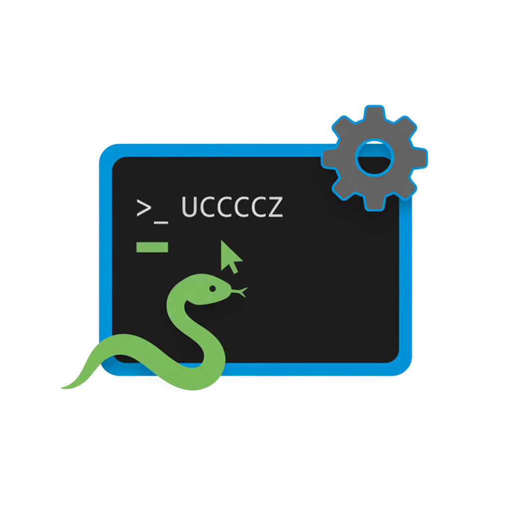

<p align="center">  </p> <h1 align="center">Smart Conda Terminal</h1> <p align="center"> <i>pubblicato come "Smart Conda Workspace"</i> </p> 

<p align="center">
  <a href="README.md"></a>
  <a href="README.it.md"></a>
</p>

<p align="center">     </p> <p align="center"> <a href="https://marketplace.visualstudio.com/items?itemName=AntonioDemarcus.smart-conda-workspace">  </a> <a href="https://marketplace.visualstudio.com/items?itemName=AntonioDemarcus.smart-conda-workspace">  </a> <a href="https://marketplace.visualstudio.com/items?itemName=AntonioDemarcus.smart-conda-workspace">  </a> </p> <p align="center"> <a href="https://github.com/AntonioDemarcus/smart-conda-terminal">  </a> <a href="https://github.com/AntonioDemarcus/smart-conda-terminal/issues">  </a> <a href="https://github.com/AntonioDemarcus/smart-conda-terminal/blob/main/LICENSE">  </a> <a href="https://github.com/AntonioDemarcus/smart-conda-terminal/fork">  </a> </p> <h3 align="center">Sistemi Operativi Supportati</h3> <p align="center">   </p>

------

## Indice

- [Informazioni](#informazioni)
- [Caratteristiche](#caratteristiche)
- [Avvio Rapido](#avvio-rapido)
- [Struttura del Progetto](#struttura-del-progetto)
- [Architettura Modulare](#architettura-modulare)
- [Comandi di Sviluppo](#comandi-di-sviluppo)
- [Auto-attivazione Shell](#auto-attivazione-shell)
- [Build e Packaging](#build-e-packaging)
- [Git Hooks per Promemoria Documentazione](#git-hooks-per-promemoria-documentazione)
- [Contribuire](#-contribuire)
- [Contatti](#-contatti)
- [Licenza](#-licenza)
- [Informazioni sul Progetto](#informazioni-sul-progetto)

----

  ## Informazioni

  Estensione VS Code per la gestione automatizzata degli ambienti conda, sviluppata con JavaScript.

  ### Denominazione del Progetto

  Questo repository, **Smart-Conda-Terminal**, contiene il codice sorgente dell'estensione **"Smart Conda Workspace"**. Il nome del repository riflette il componente tecnico principale (integrazione del terminale), mentre il nome sul Marketplace descrive la missione più ampia del progetto: creare uno spazio di lavoro automatizzato per la gestione degli ambienti Conda.

------

  ## Caratteristiche

  - ✅ Rilevamento automatico degli ambienti conda senza configurazione
  - ✅ Integrazione automatica del terminale
  - ✅ Supporto multi-piattaforma (Windows, macOS, Linux)
  - ✅ Auto-attivazione della shell quando si entra nella directory del progetto
  - ✅ Basato su JavaScript (nessuna compilazione TypeScript necessaria)

  ### Messaggio di Attivazione del Terminale

  Dopo l'attivazione dell'ambiente, il terminale visualizza un messaggio di stato unificato su una singola riga su tutte le piattaforme:

  ```
  🐍 Ambiente <env> attivato! : Python: <versione>; Node: <versione>; npm: <versione>
  ```

  **Comportamento specifico per piattaforma:**

  - Python è sempre visualizzato; Node e npm appaiono solo se disponibili nell'ambiente attivo
  - macOS/Linux utilizzano colori ANSI (verde per il nome dell'ambiente; ciano per le versioni)
  - Windows PowerShell visualizza i colori, mentre CMD usa un fallback senza colori
  - L'output verboso di `conda activate` è soppresso su macOS/Linux per evitare messaggi duplicati mantenendo la riga di riepilogo

------

  ## Avvio Rapido

  1. **Apri il progetto:**

     ```bash
     code smart-conda-terminal.code-workspace
     ```

  2. **Installa le dipendenze (se non già fatto):**

     ```bash
     npm install
     ```

  3. **Avvia lo sviluppo:**

     - Premi `F5` per eseguire l'estensione in modalità debug
     - Usa `Ctrl+Shift+P` e esegui "Developer: Reload Window" dopo le modifiche

------

  ## Struttura del Progetto

  ```
  smart-conda-terminal/
  ├── vscode-extension/          # Sorgenti estensione VS Code
  │   ├── extension.js          # File principale dell'estensione
  │   ├── modules/              # Componenti modulari
  │   │   ├── env.js           # Gestione ambiente
  │   │   ├── workspace.js     # Configurazione workspace
  │   │   ├── shell.js         # Integrazione shell
  │   │   └── version.js       # Utilità versione
  │   └── templates/            # File template
  ├── scripts/                  # Script di utilità
  │   └── update-version.js     # Gestione versione
  ├── resources/                # Icone e risorse
  ├── .vscode/                  # Configurazione VS Code
  ├── out/                      # Output build (dev)
  ├── dist/                     # Build di produzione
  └── package.json              # Configurazione estensione
  ```

------

  ## Architettura Modulare

  Questa estensione è organizzata in quattro moduli principali che lavorano insieme per fornire un flusso di lavoro coerente e riutilizzabile.

  ### Panoramica dei Moduli

  - **`env`**: Gestione ambienti Conda (rilevamento, selezione, parsing di `environment.yml`)
  - **`workspace`**: Creazione file `.code-workspace` e ottimizzazione impostazioni VS Code
  - **`shell`**: Auto-attivazione nella shell e gestione profili (macOS/Linux/Windows)
  - **`version`**: Lettura/aggiornamento versione progetto (delega a script esterni)

  ### Dettagli dei Moduli

  #### Modulo `env`

  - **Scopo**: Individuare gli ambienti disponibili e selezionare quello da associare al progetto
  - **Funzioni principali**: Ricerca ambienti (`conda env list`), inferenza ambiente da `environment.yml`, prompt di selezione
  - **I/O**: Nome ambiente, percorso interprete Python, metadati conda

  #### Modulo `workspace`

  - **Scopo**: Generare un workspace VS Code minimale e portabile, collegato all'ambiente scelto
  - **Funzioni principali**: Scrittura file `.code-workspace`, impostazioni consigliate per progetti Python/Node/Misti, integrazione template da `vscode-extension/templates/`
  - **I/O**: Percorso file workspace, impostazioni editor e terminale

  #### Modulo `shell`

  - **Scopo**: Configurare l'auto-attivazione dell'ambiente quando si entra nella directory del progetto
  - **Funzioni principali**: Aggiunta/rimozione blocchi nei profili shell (zsh/bash/PowerShell), fallback a `conda.sh`, creazione backup
  - **Sicurezza**: Modifiche idempotenti e delimitate con marker; backup prima della scrittura

  #### Modulo `version`

  - **Scopo**: Gestire la versione del progetto e fornire opzioni di incremento (patch/minor/major)
  - **Implementazione**: Funzioni di utilità in `vscode-extension/modules/version.js` (`getCurrentVersion`, `incrementVersion`); esegue lo script del progetto `scripts/update-version.js` per aggiornare file come `package.json`, `pyproject.toml`, `CHANGELOG.md`
  - **Comando correlato**: "Smart Conda: Update Project Version"

  ### Interazioni tra Moduli

  - `env` fornisce informazioni (nome/percorso) a `workspace` e `shell`
  - `workspace` configura VS Code per utilizzare l'interprete da `env`
  - `shell` garantisce l'attivazione automatica dell'ambiente quando si entra nel progetto
  - `version` opera indipendentemente ma riporta lo stato nei log dell'estensione

  ### File Chiave

  - `vscode-extension/extension.js`: Registra i comandi e orchestra i moduli
  - `vscode-extension/modules/version.js`: Utilità di versione (riutilizzabili al di fuori di `extension.js`)
  - `scripts/update-version.js`: Script lato progetto che applica gli aggiornamenti
  - `vscode-extension/templates/`: Template per workspace e impostazioni

  ### Comandi Principali

  - **Smart Conda: Configure Workspace** → usa `env`, `workspace`, `shell`
  - **Smart Conda: Update Project Version** → usa `version` (delega allo script del progetto)
  - **Smart Conda: Create New Environment** → crea un nuovo ambiente Conda da template o `environment.yml`
  - **Smart Conda: Create Requirements.txt** → genera `requirements.txt` dall'ambiente attivo o da `environment.yml`
  - **Smart Conda: Export Environment.yml** → esporta la definizione dell'ambiente in `environment.yml`

  ### UI: Explorer + Activity Bar

  - La vista "Smart Conda" in Explorer è sempre visibile quando è aperta almeno una cartella di lavoro (`workspaceFolderCount > 0`)
  - L'icona nella Activity Bar fornisce accesso rapido senza influenzare la visibilità della sezione Explorer
  - Rimosso il pulsante "Mostra/Nascondi in Explorer" dalla TreeView e la logica `smartConda:explorerVisible`
  - La TreeView espone 5 azioni operative: Configure Workspace, Update Version, Create New Environment, Create Requirements.txt, Export Environment.yml
  - Manifest aggiornato (`vscode-extension/package.json`): condizione `when` della vista Explorer impostata su `workspaceFolderCount > 0`

------

  ## Comandi di Sviluppo

  ```bash
  # Crea il pacchetto dell'estensione
  npm run package
  
  # Aggiorna versione
  npm run version:patch
  npm run version:minor
  npm run version:major
  
  # Esegui test
  npm test
  ```

------

  ## Auto-attivazione Shell

  Il progetto è configurato per attivare automaticamente l'ambiente conda quando si entra nella directory del progetto.

  **Dettagli di configurazione:**

  - Nome funzione: `sct_dev`
  - Ambiente: `sct-dev`
  - Percorso progetto: `/Users/tony/Documents/PROJECTPY/smart-conda-terminal`

  **Shell supportate:**

  - ZSH (`~/.zshrc`)
  - Bash (`~/.bashrc` o `~/.bash_profile`)
  - PowerShell

------

  ## Build e Packaging

  Per creare un pacchetto VSIX per la distribuzione:

  ```bash
  npm run package
  ```

  Questo creerà un file `.vsix` nella root del progetto.

------

  ## Git Hooks per Promemoria Documentazione

  Per registrare automaticamente voci datate in `STRUTTURA_PROGETTO.md` quando vengono modificati file chiave (es. `extension.js`, README), abilita gli hook del repository:

  ```bash
  git config core.hooksPath .githooks
  ```

  Questo abilita lo script pre-commit che aggiunge una voce con data/ora e l'elenco dei file staged.

  **Nota**: Gli aggiornamenti della documentazione seguono due flussi distinti:

  - **SAVEAGG**: Riepilogo in `UPDATE_PR.MD`
  - **DOCUPDATE**: Aggiunta strutturata in `STRUTTURA_PROGETTO.md`

------

  ## 🤝 Contribuire

  I contributi sono benvenuti! Segui queste linee guida:

  ### Come Contribuire

  1. **Fai un Fork** del repository
  2. **Crea un branch** per la tua feature (`git checkout -b feature/NuovaFeature`)
  3. **Fai Commit** delle tue modifiche (`git commit -m 'Aggiungi NuovaFeature'`)
  4. **Fai Push** al branch (`git push origin feature/NuovaFeature`)
  5. **Apri una Pull Request**

------

  ## 📞 Contatti

  - **Sviluppatore**: [Antonio DEM](https://github.com/AntonioDEM)
  - **GitHub Issues**: [Segnala problemi](https://github.com/AntonioDemarcus/smart-conda-terminal/issues)
  - **Pull Requests**: [Contribuisci](https://github.com/AntonioDemarcus/smart-conda-terminal/pulls)

------

  ## 📄 Licenza

  Questo progetto è concesso in licenza sotto la Licenza MIT - vedi il file [LICENSE](LICENSE) per i dettagli.

------

  ## Informazioni sul Progetto

  **Percorso Progetto:** /Users/tony/Documents/PROJECTPY/smart-conda-terminal
  **Creato:** Sab 27 Set 2025 08:28:49 CEST
  **Ultimo Aggiornamento:** Ven 10 Ott 2025 08:28:49 CEST
  **Utente:** tony
  **Ambiente:** sct-dev
