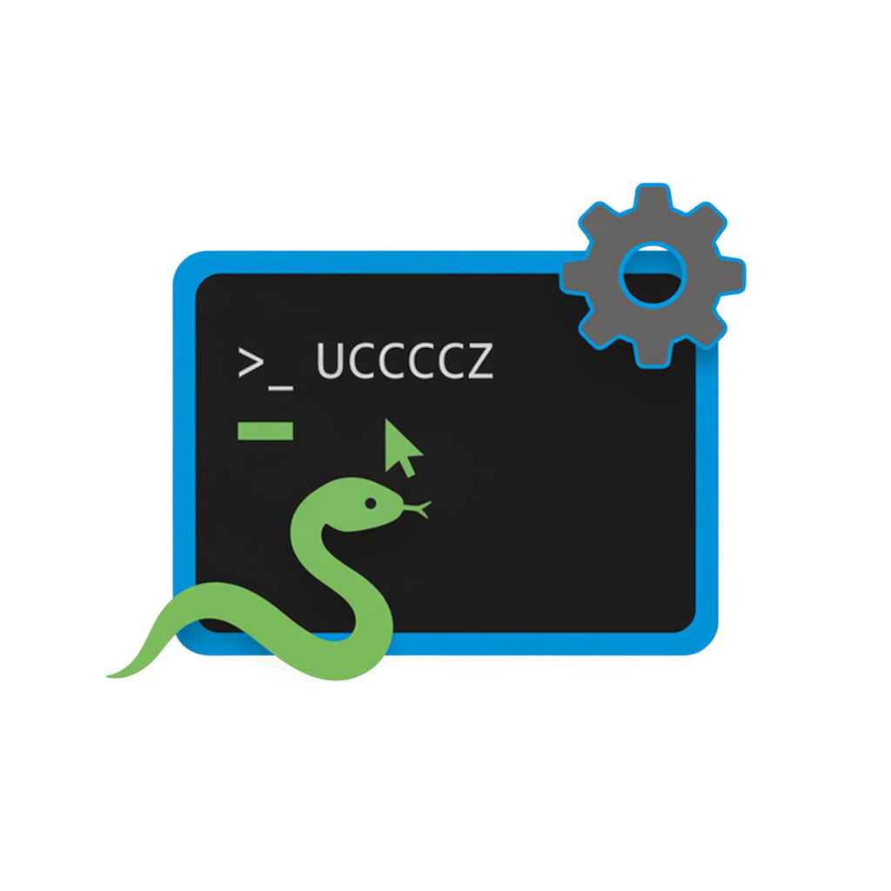

#  Smart Conda Terminal

VS Code extension for automated conda environment management, built with JavaScript.

## Project Structure

```
smart-conda-terminal/
├── vscode-extension/          # VS Code extension source
│   ├── extension.js          # Main extension file
│   └── templates/            # Template files
├── scripts/                  # Utility scripts
│   └── update-version.js     # Version management
├── resources/                # Icons and assets
├── .vscode/                  # VS Code configuration
├── out/                      # Build output (dev)
├── dist/                     # Production builds
└── package.json              # Extension configuration
```

## Quick Start

1. **Open the project:**
   ```bash
   code smart-conda-terminal.code-workspace
   ```

2. **Install dependencies (if not already done):**
   ```bash
   npm install
   ```

3. **Start development:**
   - Press `F5` to run the extension in debug mode
   - Use `Ctrl+Shift+P` and run "Developer: Reload Window" after changes

## Development Commands

```bash
# Package the extension
npm run package

# Update version
npm run version:patch
npm run version:minor
npm run version:major

# Run tests
npm test
```

## Features

- ✅ Zero-configuration conda environment detection
- ✅ Automatic terminal integration
- ✅ Multi-platform support (Windows, macOS, Linux)
- ✅ Shell auto-activation when entering project directory
- ✅ JavaScript-based (no TypeScript compilation needed)

## Shell Auto-activation

The project is configured to automatically activate the conda environment when you enter the project directory.

**Configuration details:**
- Function name: `sct_dev`
- Environment: `sct-dev`
- Project path: `/Users/tony/Documents/PROJECTPY/smart-conda-terminal`

**Supported shells:**
- ZSH (`~/.zshrc`)
- Bash (`~/.bashrc` or `~/.bash_profile`)

## Building and Packaging

To create a VSIX package for distribution:

```bash
npm run package
```

This will create a `.vsix` file in the project root.

## 🤝 Contribuire

Le contribuzioni sono benvenute! Segui queste linee guida:

### Come Contribuire

1. **Fork** il repository
2. **Crea branch** per la feature (`git checkout -b feature/NuovaFeature`)
3. **Commit** le modifiche (`git commit -m 'Aggiunta NuovaFeature'`)
4. **Push** al branch (`git push origin feature/NuovaFeature`)
5. **Apri Pull Request**

---
## 📞 Contatti

- **Developer**: [Antonio DEM](https://github.com/AntonioDEM)
- **GitHub Issues**: [Segnala problemi](https://github.com/AntonioDEM/ai-toolkit-directory/issues)
- **Pull Requests**: [Contribuisci](https://github.com/AntonioDEM/ai-toolkit-directory/pulls)

## 📄 Licenza

Questo progetto è sotto licenza MIT - vedi il file [LICENSE](LICENSE) per dettagli.

**Project Path:** /Users/tony/Documents/PROJECTPY/smart-conda-terminal
**Created:** Sab 27 Set 2025 08:28:49 CEST
**User:** tony
**Environment:** sct-dev
