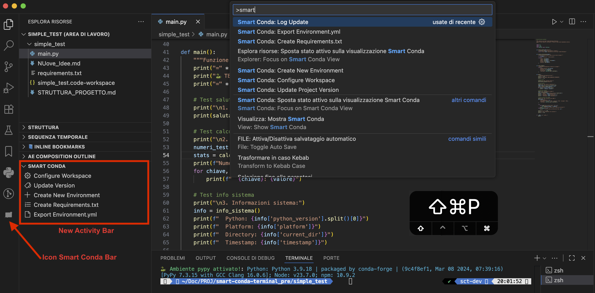

<p align="center">
  
</p>


<h1 align="center">Smart Conda Workspace</h1>

<p align="center">
  <i>Estensione VS Code minimale per la configurazione automatizzata degli workspace con ambienti conda e gestione delle versioni di progetto</i>
</p>

<p align="center">
  <a href="README.md"></a>
  <a href="README.it.md"></a>
</p>

---

## Indice

- [Caratteristiche](#caratteristiche)
- [Avvio Rapido](#avvio-rapido)
  - [Prerequisiti](#prerequisiti)
  - [Installazione](#installazione)
- [Esempio di Struttura del Progetto](#esempio-di-struttura-del-progetto)
- [Comandi](#comandi)
  - [Configura Workspace](#configura-workspace)
  - [Aggiorna Versione Progetto](#aggiorna-versione-progetto)
  - [Crea Nuovo Ambiente](#crea-nuovo-ambiente)
  - [Crea Requirements.txt](#crea-requirementstxt)
  - [Esporta Environment.yml](#esporta-environmentyml)
- [Esempio di Workflow](#esempio-di-workflow)
- [Auto-attivazione Shell](#auto-attivazione-shell)
- [Struttura Workspace Generata](#struttura-workspace-generata)
- [Configurazioni per Tipo di Progetto](#configurazioni-per-tipo-di-progetto)
- [Rilevamento Ambiente](#rilevamento-ambiente)
- [Integrazione con Script Esistenti](#integrazione-con-script-esistenti)
- [Logging e Output](#logging-e-output)
- [UI: Explorer + Activity Bar](#ui-explorer--activity-bar)
- [Note sull'Attivazione](#note-sullattivazione-progetti-senza-environmentyml)
- [Requisiti](#requisiti)
- [Risoluzione Problemi](#risoluzione-problemi)
- [Note Specifiche per Piattaforma](#note-specifiche-per-piattaforma)
- [Configurazione Manuale](#configurazione-manuale)
- [Licenza](#licenza)
- [Contribuire](#contribuire)
- [Supporto](#supporto)

---

## Caratteristiche

- **Configurazione Workspace con Un Click**: Configura automaticamente lo workspace VS Code con integrazione ambiente conda
- **Selezione Ambiente**: Scegli da qualsiasi ambiente conda disponibile
- **Supporto Multi-Piattaforma**: Funziona su Windows (PowerShell), macOS (zsh/bash) e Linux (bash)
- **Auto-attivazione Shell**: Attiva automaticamente l'ambiente conda quando entri nella directory del progetto
- **Supporto Multi-Progetto**: Funziona con progetti Python, Node.js e misti
- **Gestione Versione**: Aggiornamenti integrati della versione del progetto con generazione changelog
- **Zero Configurazione**: Funziona immediatamente con configurazioni conda esistenti

---

## Avvio Rapido

### Prerequisiti

- VS Code 1.70.0 o superiore
- Conda (Miniconda/Anaconda) installato e configurato
- Almeno un ambiente conda disponibile
- Node.js 16.0.0 o superiore (per la gestione delle versioni)

### Installazione

1. **Installa l'estensione:**
   ```bash
   code --install-extension smart-conda-workspace-1.0.1.vsix
   ```

2. **Apri il tuo progetto in VS Code**

3. **Configura workspace:**
   `Ctrl+Shift+P` → "Smart Conda: Configure Workspace"



---

## Esempio di Struttura del Progetto

### Struttura Minimale Progetto Python

Per un funzionamento ottimale dell'estensione, il tuo progetto Python dovrebbe avere questa struttura base:

```
my-python-project/
├── scripts/
│   └── update-version.js     # Richiesto per la gestione delle versioni
├── package.json              # Richiesto per il tracciamento versioni
├── pyproject.toml            # Alternativa a package.json
├── environment.yml           # Definizione ambiente Conda
├── src/
│   └── my_package/
│       ├── __init__.py
│       └── main.py
├── tests/
│   └── test_main.py
├── README.md
└── .gitignore
```

**File chiave per la funzionalità dell'estensione:**
- `scripts/update-version.js` - Script gestione versione
- `package.json` - Tracciamento versione e metadati progetto
- `environment.yml` - Specifica ambiente Conda (opzionale)

---

## Comandi

### Configura Workspace

- **Comando:** `Smart Conda: Configure Workspace`
- **Scorciatoia:** `Ctrl+Shift+P` → digita "configure workspace"
- **Descrizione:** Crea una configurazione workspace VS Code ottimizzata con auto-attivazione shell

**Cosa fa:**
1. Scansiona gli ambienti conda disponibili
2. Ti permette di selezionare l'ambiente per il tuo progetto
3. Rileva il tipo di progetto (Python/Node.js/Misto)
4. Genera il file `.code-workspace` con impostazioni ottimizzate
5. Configura l'auto-attivazione shell
6. Crea backup della configurazione shell

### Aggiorna Versione Progetto

- **Comando:** `Smart Conda: Update Project Version`
- **Scorciatoia:** `Ctrl+Shift+P` → digita "update version"
- **Descrizione:** Gestisce il versioning del progetto usando script esistenti

**Requisiti:**
- `scripts/update-version.js` deve esistere nel tuo progetto
- `package.json` o `pyproject.toml` con campo version

**Cosa fa:**
1. Legge la versione corrente dai file di progetto
2. Mostra opzioni di incremento versione (patch/minor/major)
3. Esegue lo `scripts/update-version.js` del tuo progetto
4. Aggiorna i file di versione e genera il changelog

### Crea Nuovo Ambiente

- **Comando:** `Smart Conda: Create New Environment`
- **Descrizione:** Crea un nuovo ambiente Conda da un template o da `environment.yml`

**Cosa fa:**
1. Richiede il nome dell'ambiente (o usa quello di default dal template)
2. Crea l'ambiente con `conda env create` o `conda create`
3. Opzionalmente scrive/aggiorna `environment.yml`

### Crea Requirements.txt

- **Comando:** `Smart Conda: Create Requirements.txt`
- **Descrizione:** Genera `requirements.txt` dall'ambiente attivo o da `environment.yml`

**Cosa fa:**
1. Legge i pacchetti dall'ambiente Conda attivo
2. Normalizza le versioni e produce un `requirements.txt` pulito
3. Supporta fallback a `environment.yml` quando l'ambiente non è attivo

### Esporta Environment.yml

- **Comando:** `Smart Conda: Export Environment.yml`
- **Descrizione:** Esporta la definizione dell'ambiente in `environment.yml`

**Cosa fa:**
1. Usa `conda env export --from-history` quando disponibile
2. Pulisce i metadati per la portabilità
3. Salva `environment.yml` nella root del progetto

---

## Esempio di Workflow

```bash
# 1. Apri il tuo progetto
cd /percorso/del/tuo/progetto
code .

# 2. Configura workspace (Ctrl+Shift+P)
Smart Conda: Configure Workspace
├── Seleziona ambiente conda: "my-env"
├── Seleziona tipo progetto: "Python"
├── ✅ File workspace creato
└── ✅ Auto-attivazione shell configurata

# 3. Chiudi e riapri dal file workspace
# L'ambiente ora si attiva automaticamente quando entri nella directory del progetto

# 4. Aggiorna versione quando necessario (Ctrl+Shift+P)
Smart Conda: Update Project Version
├── Corrente: 1.0.0
├── Seleziona: "minor" → 1.1.0
└── ✅ Versione aggiornata + changelog
```

---

## Auto-attivazione Shell

L'estensione configura automaticamente la tua shell per attivare l'ambiente conda quando entri nella directory del progetto.

### Piattaforme Supportate

| Piattaforma | Shell | File di Configurazione |
|-------------|-------|------------------------|
| **Windows** | PowerShell | `~/Documents/PowerShell/Microsoft.PowerShell_profile.ps1` |
| **macOS** | zsh | `~/.zshrc` |
| **macOS** | bash | `~/.bash_profile` o `~/.bashrc` |
| **Linux** | bash | `~/.bashrc` |

### Esempio di Configurazione Aggiunta

**Per sistemi Unix (macOS/Linux):**
```bash
# *my-project* - Auto-attivazione
# Generato da Smart Conda Workspace il [timestamp]
my_project() {
    if [[ "$PWD" == *"/percorso/del/my-project"* ]]; then
        conda activate my-env 2>/dev/null || true
    fi
}

# Integrazione ZSH
if [[ -n "$ZSH_VERSION" ]]; then
    chpwd_functions+=(my_project)
    my_project  # Attiva ora
fi
```

**Per Windows PowerShell:**
```powershell
# *my-project* - Auto-attivazione
function my_project {
    $currentPath = Get-Location
    if ($currentPath.Path -like "*C:\percorso\del\my-project*") {
        conda activate my-env
    }
}
# Auto-attivazione al cambio directory
```

### Messaggio di Attivazione Terminale

Dopo l'attivazione dell'ambiente, il terminale visualizza un messaggio di stato unificato su una singola riga su tutte le piattaforme:

```
🐍 Ambiente <env> attivato! : Python: <versione>; Node: <versione>; npm: <versione>
```

**Comportamento specifico per piattaforma:**
- Python è sempre visualizzato; Node e npm appaiono solo se disponibili nell'ambiente attivo
- macOS/Linux utilizzano colori ANSI (verde per il nome dell'ambiente; ciano per le versioni)
- Windows PowerShell visualizza i colori, mentre CMD usa un fallback senza colori
- L'output verboso di `conda activate` è soppresso su macOS/Linux per evitare messaggi duplicati mantenendo la riga di riepilogo

---

## Struttura Workspace Generata

Dopo aver eseguito "Configure Workspace", otterrai:

```json
your-project.code-workspace
{
  "folders": [{ "path": "." }],
  "settings": {
    "python.defaultInterpreterPath": "/percorso/conda/envs/your-env/bin/python",
    "python.condaPath": "/percorso/conda/bin/conda",
    "python.terminal.activateEnvironment": true,
    "terminal.integrated.defaultProfile.osx": "conda-env"
  },
  "extensions": {
    "recommendations": [
      "ms-python.python",
      "ms-python.vscode-pylance"
    ]
  }
}
```

---

## Configurazioni per Tipo di Progetto

### Progetti Python
- **Impostazioni:** Formattatore Black, Pylint, integrazione pytest
- **Estensioni:** Python, Pylance, Black formatter, Jupyter
- **Terminale:** Auto-attiva ambiente conda

### Progetti Node.js
- **Impostazioni:** Prettier, supporto TypeScript, auto-imports
- **Estensioni:** Prettier, TypeScript, Tailwind CSS
- **Terminale:** Node.js + ambiente conda

### Progetti Misti
- **Impostazioni:** Configurazione combinata Python + Node.js
- **Estensioni:** Strumenti di sviluppo sia Python che Node.js
- **Terminale:** Pronto per sviluppo full stack

---

## Rilevamento Ambiente

L'estensione rileva automaticamente:

- **Ambienti conda disponibili** via `conda env list`
- **Ambiente attivo corrente** (mostrato per primo nella selezione)
- **Versioni Python** per ogni ambiente
- **Tipo di progetto** basato sui file (`package.json`, `pyproject.toml`, ecc.)
- **Percorsi specifici per piattaforma** (Windows vs Unix)

---

## Integrazione con Script Esistenti

Questa estensione si integra con gli script di progetto:

- **`scripts/update-version.js`**: Chiamato per la gestione delle versioni
- **`package.json`**: Letto per versione corrente e metadati
- **`pyproject.toml`**: Fonte alternativa di versione per progetti Python
- **`environment.yml`**: Configurazione ambiente Conda

**Nota:** Lo script `update-version.js` deve esistere in ogni progetto dove vuoi la gestione versioni, non nell'estensione stessa.

---

## Logging e Output

- L'estensione scrive log leggibili nel canale Output `Smart Conda Logs`
- Apri tramite `View → Output` e seleziona `Smart Conda Logs` dal menu a tendina
- Le voci tipiche includono rilevamento ambiente, registrazione comandi ed eventi di aggiornamento

---

## UI: Explorer + Activity Bar

- La vista "Smart Conda" in Explorer è sempre visibile quando è aperta almeno una cartella di lavoro (`workspaceFolderCount > 0`)
- L'icona nella Activity Bar fornisce accesso rapido senza influenzare la visibilità della sezione Explorer
- Rimosso il pulsante "Mostra/Nascondi in Explorer" dalla TreeView e la logica `smartConda:explorerVisible`
- La TreeView espone 5 azioni operative: Configure Workspace, Update Version, Create New Environment, Create Requirements.txt, Export Environment.yml
- Manifest aggiornato (`vscode-extension/package.json`): condizione `when` della vista Explorer impostata su `workspaceFolderCount > 0`


---

## Note sull'Attivazione (progetti senza environment.yml)

- L'estensione si attiva all'avvio e quando è presente una cartella di lavoro
- `environment.yml` è opzionale: se assente, puoi comunque eseguire `Smart Conda: Configure Workspace` e selezionare manualmente un ambiente conda
- L'inferenza del nome ambiente in alcune funzionalità preferisce `environment.yml` se presente; altrimenti ricorre al rilevamento euristico o prompt

---

## Requisiti

### Per Configurazione Workspace
- Qualsiasi ambiente conda disponibile
- Permessi di scrittura nella directory del progetto
- Permessi di scrittura nel file di configurazione shell

### Per Aggiornamenti Versione
- Script `scripts/update-version.js` nel tuo progetto
- `package.json` o `pyproject.toml` con campo version
- Repository Git (opzionale, per commit automatici)

---

## Risoluzione Problemi

### "Nessun ambiente conda trovato"
- Assicurati che conda sia installato e nel PATH
- Esegui `conda env list` nel terminale per verificare
- Controlla l'inizializzazione conda nella configurazione shell

### "update-version.js non trovato"
- Assicurati che `scripts/update-version.js` esista nella root del tuo progetto (non nell'estensione)
- Controlla i permessi del file
- Lo script deve essere un file Node.js eseguibile

### "I comandi dell'estensione non compaiono"
- Ricarica la finestra VS Code: `Ctrl+Shift+P` → "Developer: Reload Window"
- Controlla che l'estensione sia abilitata nel pannello Estensioni
- Assicurati di avere una cartella di lavoro aperta
- Nel pannello Output, seleziona `Smart Conda Logs` per vedere i dettagli di attivazione

### Auto-attivazione shell non funzionante
- Riavvia il terminale o esegui: `source ~/.zshrc` (Unix) o riavvia PowerShell (Windows)
- Controlla che la funzione sia stata aggiunta al tuo file di configurazione shell
- Verifica che conda sia correttamente inizializzato nella tua shell

### Struttura Package.json per Gestione Versione

Per usare il comando "Update Project Version", il tuo `package.json` deve includere:

```json
{
  "name": "nome-tuo-progetto",
  "version": "1.0.0",
  "description": "Descrizione del tuo progetto",
  "scripts": {
    "version:patch": "node scripts/update-version.js patch",
    "version:minor": "node scripts/update-version.js minor",
    "version:major": "node scripts/update-version.js major"
  },
  "author": "Tuo Nome",
  "license": "MIT"
}
```

**Campi richiesti:**
- `name`: Identificatore progetto
- `version`: Versione corrente (versioning semantico)
- `description`: Descrizione progetto

**Campi raccomandati:**
- `scripts`: Script npm per gestione versione
- `author`: Autore progetto
- `license`: Tipo licenza

**Nota:** Anche per progetti solo Python, è richiesto un `package.json` minimale per la funzionalità di gestione versione.

---

## Note Specifiche per Piattaforma

### Windows
- Richiede PowerShell (supportato PowerShell 5.x o 7.x)
- Crea profilo PowerShell se non esiste
- Usa percorsi e comandi stile Windows

### macOS/Linux
- Supporta shell zsh e bash
- Usa percorsi stile Unix e attivazione conda
- Si integra con funzioni shell esistenti

---

## Configurazione Manuale

Se il rilevamento automatico fallisce, puoi manualmente:

1. **Controllare configurazione conda:**
   ```bash
   conda --version
   conda env list
   ```

2. **Verificare struttura progetto:**
   ```bash
   ls -la scripts/update-version.js
   cat package.json | grep version
   ```

3. **Testare estensione manualmente:**
   - Apri Command Palette: `Ctrl+Shift+P`
   - Digita: "Smart Conda"
   - Seleziona comandi disponibili

---

## Licenza

Licenza MIT - sentiti libero di modificare e distribuire.

---

## Contribuire

1. Fai un fork del repository
2. Crea un branch per la feature
3. Fai modifiche nella directory `vscode-extension/`
4. Testa con `F5` (Run Extension)
5. Invia pull request

---

## Supporto

Per problemi e richieste di funzionalità:
- Controlla la sezione risoluzione problemi sopra
- Verifica che i prerequisiti siano soddisfatti
- Crea un report dettagliato del problema con:
  - Versione VS Code
  - Sistema operativo
  - Versione Conda
  - Struttura progetto
  - Messaggi di errore

---

**Smart Conda Workspace** - Semplifica il tuo workflow di sviluppo basato su conda su tutte le piattaforme!