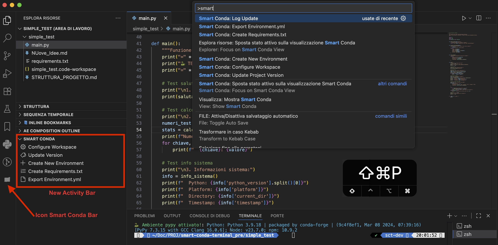

 <h1 align="center">Smart Conda Workspace</h1> <p align="center"> <i>Minimal VS Code extension for automated conda environment workspace configuration and project versioning."</i> </p> <p align="center">
<p align="center">
  <a href="README.md"></a>
  <a href="https://github.com/AntonioDEM/smart-conda-terminal/blob/main/README.it.md"></a>
</p>

------

## Table of Contents

- [Features](#features)
- [Quick Start](#quick-start)
  - [Prerequisites](#prerequisites)
  - [Installation](#installation)
- [Project Structure Example](#project-structure-example)
- [Commands](#commands)
  - [Configure Workspace](#configure-workspace)
  - [Update Project Version](#update-project-version)
  - [Create New Environment](#create-new-environment)
  - [Create Requirements.txt](#create-requirementstxt)
  - [Export Environment.yml](#export-environmentyml)
- [Workflow Example](#workflow-example)
- [Shell Auto-Activation](#shell-auto-activation)
- [Generated Workspace Structure](#generated-workspace-structure)
- [Project Type Configurations](#project-type-configurations)
- [Environment Detection](#environment-detection)
- [Integration with Existing Scripts](#integration-with-existing-scripts)
- [Logging & Output](#logging--output)
- [UI: Explorer + Activity Bar](#ui-explorer--activity-bar)
- [Activation Notes](#activation-notes-projects-without-environmentyml)
- [Requirements](#requirements)
- [Troubleshooting](#troubleshooting)
- [Platform-Specific Notes](#platform-specific-notes)
- [Manual Configuration](#manual-configuration)
- [License](#license)
- [Contributing](#contributing)
- [Support](#support)

------

## Features

- **One-Click Workspace Configuration**: Automatically configure VS Code workspace with conda environment integration
- **Environment Selection**: Choose from any available conda environment
- **Multi-Platform Support**: Works on Windows (PowerShell), macOS (zsh/bash), and Linux (bash)
- **Shell Auto-Activation**: Automatically activates conda environment when entering project directory
- **Multi-Project Support**: Works with Python, Node.js, and mixed projects
- **Version Management**: Integrated project version updates with changelog generation
- **Zero Configuration**: Works out of the box with existing conda setups

------

## Quick Start

### Prerequisites

- VS Code 1.70.0 or higher
- Conda (Miniconda/Anaconda) installed and configured
- At least one conda environment available
- Node.js 16.0.0 or higher (for version management)

### Installation

1. **Install the extension:**

   ```bash
   code --install-extension smart-conda-workspace-1.0.1.vsix
   ```

2. **Open your project in VS Code**

3. **Configure workspace:** `Ctrl+Shift+P` → "Smart Conda: Configure Workspace"


------

## Project Structure Example

### Minimal Python Project Structure

For the extension to work optimally, your Python project should have this basic structure:

```
my-python-project/
├── scripts/
│   └── update-version.js     # Required for version management
├── package.json              # Required for version tracking
├── pyproject.toml            # Alternative to package.json
├── environment.yml           # Conda environment definition
├── src/
│   └── my_package/
│       ├── __init__.py
│       └── main.py
├── tests/
│   └── test_main.py
├── README.md
└── .gitignore
```

**Key files for extension functionality:**

- `scripts/update-version.js` - Version management script
- `package.json` - Version tracking and project metadata
- `environment.yml` - Conda environment specification (optional)

------

## Commands

### Configure Workspace

- **Command:** `Smart Conda: Configure Workspace`
- **Shortcut:** `Ctrl+Shift+P` → type "configure workspace"
- **Description:** Creates optimized VS Code workspace configuration with shell auto-activation

**What it does:**

1. Scans available conda environments
2. Lets you select the environment for your project
3. Detects project type (Python/Node.js/Mixed)
4. Generates `.code-workspace` file with optimized settings
5. Configures shell auto-activation
6. Creates backup of shell configuration

### Update Project Version

- **Command:** `Smart Conda: Update Project Version`
- **Shortcut:** `Ctrl+Shift+P` → type "update version"
- **Description:** Manages project versioning using existing scripts

**Requirements:**

- `scripts/update-version.js` must exist in your project
- `package.json` or `pyproject.toml` with version field

**What it does:**

1. Reads current version from project files
2. Shows version increment options (patch/minor/major)
3. Executes your project's `scripts/update-version.js`
4. Updates version files and generates changelog

### Create New Environment

- **Command:** `Smart Conda: Create New Environment`
- **Description:** Creates a new Conda environment from a template or from `environment.yml`

**What it does:**

1. Prompts for environment name (or uses default from template)
2. Creates the environment with `conda env create` or `conda create`
3. Optionally writes/updates `environment.yml`

### Create Requirements.txt

- **Command:** `Smart Conda: Create Requirements.txt`
- **Description:** Generates `requirements.txt` from the active environment or from `environment.yml`

**What it does:**

1. Reads packages from the active Conda environment
2. Normalizes versions and outputs a clean `requirements.txt`
3. Supports fallback to `environment.yml` when environment is not active

### Export Environment.yml

- **Command:** `Smart Conda: Export Environment.yml`
- **Description:** Exports the environment definition to `environment.yml`

**What it does:**

1. Uses `conda env export --from-history` when available
2. Cleans metadata for portability
3. Saves `environment.yml` in the project root

------

## Workflow Example

```bash
# 1. Open your project
cd /path/to/your/project
code .

# 2. Configure workspace (Ctrl+Shift+P)
Smart Conda: Configure Workspace
├── Select conda environment: "my-env"
├── Select project type: "Python"
├── ✅ Workspace file created
└── ✅ Shell auto-activation configured

# 3. Close and reopen from workspace file
# Environment now auto-activates when entering project directory

# 4. Update version when needed (Ctrl+Shift+P)
Smart Conda: Update Project Version
├── Current: 1.0.0
├── Select: "minor" → 1.1.0
└── ✅ Version updated + changelog
```

------

## Shell Auto-Activation

The extension automatically configures your shell to activate the conda environment when you enter the project directory.

### Supported Platforms

| Platform    | Shell      | Configuration File                                        |
| ----------- | ---------- | --------------------------------------------------------- |
| **Windows** | PowerShell | `~/Documents/PowerShell/Microsoft.PowerShell_profile.ps1` |
| **macOS**   | zsh        | `~/.zshrc`                                                |
| **macOS**   | bash       | `~/.bash_profile` or `~/.bashrc`                          |
| **Linux**   | bash       | `~/.bashrc`                                               |

### Example Configuration Added

**For Unix systems (macOS/Linux):**

```bash
# *my-project* - Auto-activation
# Generated by Smart Conda Workspace on [timestamp]
my_project() {
    if [[ "$PWD" == *"/path/to/my-project"* ]]; then
        conda activate my-env 2>/dev/null || true
    fi
}

# ZSH integration
if [[ -n "$ZSH_VERSION" ]]; then
    chpwd_functions+=(my_project)
    my_project  # Activate now
fi
```

**For Windows PowerShell:**

```powershell
# *my-project* - Auto-activation
function my_project {
    $currentPath = Get-Location
    if ($currentPath.Path -like "*C:\path\to\my-project*") {
        conda activate my-env
    }
}
# Auto-trigger on directory change
```

### Terminal Activation Message

After environment activation, the terminal displays a unified single-line status message across platforms:

```
🐍 Ambiente <env> attivato! : Python: <version>; Node: <version>; npm: <version>
```

**Platform-specific behavior:**

- Python is always displayed; Node and npm only appear if available in the active environment
- macOS/Linux use ANSI colors (green for environment name; cyan for versions)
- Windows PowerShell displays colors, while CMD uses a fallback without colors
- Verbose `conda activate` output is suppressed on macOS/Linux to avoid duplicate messages while keeping the summary line

------

## Generated Workspace Structure

After running "Configure Workspace", you'll get:

```json
your-project.code-workspace
{
  "folders": [{ "path": "." }],
  "settings": {
    "python.defaultInterpreterPath": "/path/to/conda/envs/your-env/bin/python",
    "python.condaPath": "/path/to/conda/bin/conda",
    "python.terminal.activateEnvironment": true,
    "terminal.integrated.defaultProfile.osx": "conda-env"
  },
  "extensions": {
    "recommendations": [
      "ms-python.python",
      "ms-python.vscode-pylance"
    ]
  }
}
```

------

## Project Type Configurations

### Python Projects

- **Settings:** Black formatter, Pylint, pytest integration
- **Extensions:** Python, Pylance, Black formatter, Jupyter
- **Terminal:** Auto-activates conda environment

### Node.js Projects

- **Settings:** Prettier, TypeScript support, auto-imports
- **Extensions:** Prettier, TypeScript, Tailwind CSS
- **Terminal:** Node.js + conda environment

### Mixed Projects

- **Settings:** Combined Python + Node.js configuration
- **Extensions:** Both Python and Node.js development tools
- **Terminal:** Full stack development ready

------

## Environment Detection

The extension automatically detects:

- **Available conda environments** via `conda env list`
- **Current active environment** (shown first in selection)
- **Python versions** for each environment
- **Project type** based on files (`package.json`, `pyproject.toml`, etc.)
- **Platform-specific paths** (Windows vs Unix)

------

## Integration with Existing Scripts

This extension integrates with project scripts:

- **`scripts/update-version.js`**: Called for version management
- **`package.json`**: Read for current version and metadata
- **`pyproject.toml`**: Alternative version source for Python projects
- **`environment.yml`**: Conda environment configuration

**Note:** The `update-version.js` script must exist in each project where you want version management, not in the extension itself.

------

## Logging & Output

- The extension writes human-readable logs to the Output channel `Smart Conda Logs`
- Open via `View → Output` and pick `Smart Conda Logs` from the dropdown
- Typical entries include environment detection, command registration, and update events

------

## UI: Explorer + Activity Bar

- The "Smart Conda" view in Explorer is always visible when at least one workspace folder is open (`workspaceFolderCount > 0`)
- The Activity Bar icon provides quick access without affecting Explorer section visibility
- Removed "Show/Hide in Explorer" button from TreeView and `smartConda:explorerVisible` logic
- TreeView exposes 5 operational actions: Configure Workspace, Update Version, Create New Environment, Create Requirements.txt, Export Environment.yml
- Updated manifest (`vscode-extension/package.json`): Explorer view `when` condition set to `workspaceFolderCount > 0`



------

## Activation Notes (projects without environment.yml)

- The extension activates on startup and when a workspace folder is present
- `environment.yml` is optional: if absent, you can still run `Smart Conda: Configure Workspace` and select a conda environment manually
- Environment name inference in some features prefers `environment.yml` if present; otherwise falls back to heuristic detection or prompts

------

## Requirements

### For Workspace Configuration

- Any conda environment available
- Write permissions in project directory
- Shell configuration file write permissions

### For Version Updates

- `scripts/update-version.js` script in your project
- `package.json` or `pyproject.toml` with version field
- Git repository (optional, for automatic commits)

------

## Troubleshooting

### "No conda environments found"

- Ensure conda is installed and in PATH
- Run `conda env list` in terminal to verify
- Check conda initialization in shell configuration

### "update-version.js not found"

- Ensure `scripts/update-version.js` exists in your project root (not in the extension)
- Check file permissions
- Script must be executable Node.js file

### "Extension commands not showing"

- Reload VS Code window: `Ctrl+Shift+P` → "Developer: Reload Window"
- Check extension is enabled in Extensions panel
- Ensure you have a workspace folder open
- In the Output panel, select `Smart Conda Logs` to see activation details

### Shell auto-activation not working

- Restart your terminal or run: `source ~/.zshrc` (Unix) or restart PowerShell (Windows)
- Check that the function was added to your shell configuration file
- Verify conda is properly initialized in your shell

### Package.json Structure for Version Management

To use the "Update Project Version" command, your `package.json` must include:

```json
{
  "name": "your-project-name",
  "version": "1.0.0",
  "description": "Your project description",
  "scripts": {
    "version:patch": "node scripts/update-version.js patch",
    "version:minor": "node scripts/update-version.js minor",
    "version:major": "node scripts/update-version.js major"
  },
  "author": "Your Name",
  "license": "MIT"
}
```

**Required fields:**

- `name`: Project identifier
- `version`: Current version (semantic versioning)
- `description`: Project description

**Recommended fields:**

- `scripts`: npm scripts for version management
- `author`: Project author
- `license`: License type

**Note:** Even for Python-only projects, a minimal `package.json` is required for version management functionality.

------

## Platform-Specific Notes

### Windows

- Requires PowerShell (PowerShell 5.x or 7.x supported)
- Creates PowerShell profile if it doesn't exist
- Uses Windows-style paths and commands

### macOS/Linux

- Supports zsh and bash shells
- Uses Unix-style paths and conda activation
- Integrates with existing shell functions

------

## Manual Configuration

If automatic detection fails, you can manually:

1. **Check conda setup:**

   ```bash
   conda --version
   conda env list
   ```

2. **Verify project structure:**

   ```bash
   ls -la scripts/update-version.js
   cat package.json | grep version
   ```

3. **Test extension manually:**

   - Open Command Palette: `Ctrl+Shift+P`
   - Type: "Smart Conda"
   - Select available commands

------

## License

MIT License - feel free to modify and distribute.

------

## Contributing

1. Fork the repository
2. Create feature branch
3. Make changes in `vscode-extension/` directory
4. Test with `F5` (Run Extension)
5. Submit pull request

------

## Support

For issues and feature requests:

- Check troubleshooting section above
- Verify prerequisites are met
- Create detailed issue report with:
  - VS Code version
  - Operating system
  - Conda version
  - Project structure
  - Error messages

------

**Smart Conda Workspace** - Streamline your conda-based development workflow across all platforms!